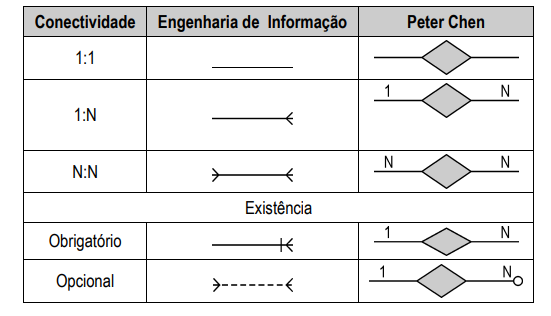

## Conceituação básica

- Modelagem de dados: é uma espeficicação que, por meio da "mineração de dados" (_foco total aos dados_) dentro de um contexto, nos permite `representar e entender` (**abstração**) um problema; descrevendo estruturas lógicas e físicas de um banco de dados.
  - Entender e representar o minimundo voltando-se aos dados, descartando o aspectos de funcionalidades/implementação do serviço.

- Modelar um banco dados é importante pois evita retrabalho e perca de tempo a longo prazo. Problemas causados pela falta de planejamento e análise:
  - omissão de dados exigidos
  - inconsistências/redundância
  - impossibilidade de evolução do sistema

- O tempo a modelagem de dados é revertido em benefícios consideráveis. Por fim, a qualidade de um sistema é diretamento proporcional a qualidade de sua modelagem.

---

## O que são banco de dados?

- Bancos de dados é um coletânia de abstrações (tabelas), definidos como objetos, que têm seus atributos (colunas) bem definidos e armazenados (linhas) nesse sistema.
  - lógico e coerente
  - propósito específico
  - representa o minimundo (contexto do problema)

### Abstrações

- `Abstração`: **levar em consideração** coisas importantes **e desprezar** outras que não consideramos válidas.
  - síntese mental sem conceituações técnicas
    - Por meio da abastraçãom, cria-se a `Classificação de Abstração` no qual organizamos objetos reais por características em comum.
    - `Agregação de Abstração`: conceito muito semelhante a herança, onde objetos menores compõem um maior.
    - O primeiro nível de abstração é a `Generalização` onde relacionamos conjuntos e subconjuntos.
  - Para determinar abastrações comece pelo entendimento de dados (entidades, atributos e relacionamentos)

---

## Modelo entidade relacionamento

A modelagem é específica ao minimundo, não focando-se tão somente no problema. Entretando, mesmo com essa característica singular, temos um tipo específico de modelo que permite modelar qualquer realidade: `Entidade-Relacionamento`. Este modelo baseia a percepção do mundo real em um conjunto de objetos básicos: `entidades (retângulos) e seus atributos (elípses)` e `relacionamentos (losangos)`.

### Objetos conceituais

- `Entidades`: qualquer coisa do mundo real a qual se deseja armazenar informações (pessoas, objetos materiáis ou abstratos).
  - Substantivo singular contido por um retângulo.

- `Relacionamentos`: associações existentes entre entidades.
  - Linha que une duas ou mais entidades, contendo ainda um losango com o verbo flexionado ao centro.
  - Grau de relacionamento: binário, ternário e e-nário. O que descreve a quantidade de entidades envolvidas no fato.

- `Cardinalidade (conectividade)`: um-para-um, um-para-muitos e muitos-para-muitos (_entidades associativas_).

  

- `Atributos`: propriedades elementares de uma entidade ou de um relacionamento.
  - Uma elipse com o nome do atributo.
  - Atributos podem ser **identificadores** (PK ou FK) e **descritores** (int, float, decimal, varchar, date, bool, json).

---

## Diagramas

- Modelo `conceitual`:
  - Modelo Entidade-Relacionamento: assim como o banco de dados concreto, tenta representar o **minimundo**, porém independente de sua implementação tecnológica (alto nível). O foco é totalmente voltado ao entendimento do **objeto observado/ambiente sob análise**
    - `Observar -> Entender -> Representar -> Verificar -> Validar`

- Modelo `lógico`:
  - Diagrama Entidade-Relacionamento: não foca em interpretar somente o contexto, pois avança levando em consideração a abordagem do SGDB que será utilizado (relacional, orientado a objetos, etc).

- Modelo `físico`:
  - Script de criação de banco de dados (SQL) executado pelo SGDB

Assim, isóla-se o problema em diferentes escopos lógicos (intenções), avançando o detalhamento do modelo em cada etapa.

---

## Normalização

### 1FN — Remove atributos multivalorados, tornando-os _atômicos_

> **Regra:** cada célula deve conter um único valor indivisível.

```
❌ VIOLAÇÃO — atributo multivalorado numa única célula:

TABELA: ALUNO
+----------+-------+----------------------------------+
| id_aluno | nome  | telefones                        |
+----------+-------+----------------------------------+
| 1        | Ana   | (88)99001-0001, (88)99001-0002   |
| 2        | João  | (85)98888-1111                   |
+----------+-------+----------------------------------+
                              ↑
                    dois valores numa mesma célula!

✅ CORREÇÃO — separar em tabela própria:

TABELA: ALUNO                  TABELA: TELEFONE
+----------+-------+           +----------+----------------+
| id_aluno | nome  |           | id_aluno | numero         |
+----------+-------+           +----------+----------------+
| 1        | Ana   |           | 1        | (88)99001-0001 |
| 2        | João  |           | 1        | (88)99001-0002 |
+----------+-------+           | 2        | (85)98888-1111 |
                               +----------+----------------+
```

---

### 2FN — Resolve dependências parciais

> **Regra:** todo atributo não-chave deve depender da **chave primária inteira**, não de apenas parte dela. Só se aplica quando há **chave composta**.

```
❌ VIOLAÇÃO — nome_disciplina depende só de id_disciplina:

TABELA: MATRICULA
+-----------+---------------+-------------------+-------+
| id_aluno  | id_disciplina | nome_disciplina   | nota  |
+-----------+---------------+-------------------+-------+
| 1         | D1            | Banco de Dados    | 9.5   |
| 1         | D2            | Redes             | 8.0   |
| 2         | D1            | Banco de Dados    | 7.0   |
+-----------+---------------+-------------------+-------+
     ↑              ↑               ↑
     └──────────────┘               │
      Chave Primária Composta       │
                                    │
              depende só de id_disciplina!
              (dependência PARCIAL) ← viola 2FN

✅ CORREÇÃO — separar o atributo dependente parcial:

TABELA: MATRICULA              TABELA: DISCIPLINA
+-----------+---------------+-------+    +---------------+-------------------+
| id_aluno  | id_disciplina | nota  |    | id_disciplina | nome_disciplina   |
+-----------+---------------+-------+    +---------------+-------------------+
| 1         | D1            | 9.5   |    | D1            | Banco de Dados    |
| 1         | D2            | 8.0   |    | D2            | Redes             |
| 2         | D1            | 7.0   |    +---------------+-------------------+
+-----------+---------------+-------+
```

---

### 3FN — Resolve dependências transitivas

> **Regra:** nenhum atributo não-chave deve depender de outro atributo não-chave. Ou seja: todo atributo deve depender **diretamente** da PK.

```
❌ VIOLAÇÃO — dependência transitiva via cod_depto:

TABELA: FUNCIONARIO
+-----+-------+-----------+--------------+
| cpf | nome  | cod_depto | local_depto  |
+-----+-------+-----------+--------------+
| 001 | João  | TI        | Bloco A      |
| 002 | Ana   | RH        | Bloco B      |
+-----+-------+-----------+--------------+

  cpf → cod_depto → local_depto
   ↑                     ↑
  PK          depende de cod_depto,
              NÃO diretamente da PK! ← viola 3FN

Outro exemplo:
  cod_condutor → placa_veiculo → marca → modelo
                                   ↑
                        transitiva em cadeia!

✅ CORREÇÃO — isolar a dependência transitiva:

TABELA: FUNCIONARIO            TABELA: DEPARTAMENTO
+-----+-------+-----------+   +-----------+--------------+
| cpf | nome  | cod_depto |   | cod_depto | local_depto  |
+-----+-------+-----------+   +-----------+--------------+
| 001 | João  | TI        |   | TI        | Bloco A      |
| 002 | Ana   | RH        |   | RH        | Bloco B      |
+-----+-------+-----------+   +-----------+--------------+
               ↑ FK
```

---

### BCNF — Boyce-Codd Normal Form

> **Regra:** para toda dependência funcional `A → B`, **A deve ser uma superchave**. É mais restrita que a 3FN — cobre casos onde atributos que fazem parte da chave geram dependências problemáticas.

```
❌ VIOLAÇÃO — atributo não-chave determinando parte da chave:

Contexto: um aluno pode se matricular em várias disciplinas,
cada disciplina é ministrada por um único professor,
e um professor ministra apenas uma disciplina.

TABELA: MATRICULA
+-----------+------------------+-------------------+
| id_aluno  | nome_professor   | nome_disciplina   |
+-----------+------------------+-------------------+
| 1         | Prof. Silva      | Banco de Dados    |
| 1         | Prof. Lima       | Redes             |
| 2         | Prof. Silva      | Banco de Dados    |
+-----------+------------------+-------------------+

  PK composta: (id_aluno, nome_disciplina)
  MAS: nome_professor → nome_disciplina
          ↑
   nome_professor NÃO é superchave! ← viola BCNF

✅ CORREÇÃO:

TABELA: MATRICULA              TABELA: PROFESSOR_DISCIPLINA
+-----------+------------------+   +------------------+-------------------+
| id_aluno  | nome_professor   |   | nome_professor   | nome_disciplina   |
+-----------+------------------+   +------------------+-------------------+
| 1         | Prof. Silva      |   | Prof. Silva      | Banco de Dados    |
| 1         | Prof. Lima       |   | Prof. Lima       | Redes             |
| 2         | Prof. Silva      |   +------------------+-------------------+
+-----------+------------------+
```

---

### 4FN — Resolve dependências multivaloradas independentes

> **Regra:** para toda dependência multivalorada `A →→ B`, **A deve ser uma superchave**. Evita a explosão combinatória de tuplas gerada por dois conjuntos independentes de valores.

```
❌ VIOLAÇÃO — duas dependências multivaloradas independentes:

Contexto: uma pessoa pode estudar em várias escolas E se
candidatar a várias faculdades (fatos independentes entre si).

TABELA: APPLY
+-----+-----------------+------------------+
| cpf | nome_escola     | nome_faculdade   |
+-----+-----------------+------------------+
| 001 | Escola A        | UFCA             |
| 001 | Escola A        | UFC              |
| 001 | Escola B        | UFCA             |  ← repetição desnecessária
| 001 | Escola B        | UFC              |  ← repetição desnecessária
+-----+-----------------+------------------+
  cpf →→ nome_escola        (independente)
  cpf →→ nome_faculdade     (independente)
                ↑
    combinações explodem: escolas × faculdades!

✅ CORREÇÃO — decompor em duas tabelas:

TABELA: ESCOLA                 TABELA: FACULDADE
+-----+-----------------+      +-----+------------------+
| cpf | nome_escola     |      | cpf | nome_faculdade   |
+-----+-----------------+      +-----+------------------+
| 001 | Escola A        |      | 001 | UFCA             |
| 001 | Escola B        |      | 001 | UFC              |
+-----+-----------------+      +-----+------------------+
```

---

### 📐 Visão geral — progressão das formas normais

```
┌──────┬──────────────────────────────┬──────────────────────────────────────┐
│ Forma│ O que resolve?               │ Regra principal                      │
├──────┼──────────────────────────────┼──────────────────────────────────────┤
│  1FN │ Atributos não-atômicos       │ Cada célula = 1 valor                │
│  2FN │ Dependência parcial          │ Atributos dependem da PK inteira     │
│  3FN │ Dependência transitiva       │ Atrib. não-chave → só da PK          │
│ BCNF │ Dependência de não-superchave│ Todo determinante é superchave       │
│  4FN │ Dep. multivalorada indep.    │ A →→ B exige que A seja superchave   │
└──────┴──────────────────────────────┴──────────────────────────────────────┘

         1FN ⊂ 2FN ⊂ 3FN ⊂ BCNF ⊂ 4FN
         (cada forma normal é mais restrita que a anterior)
```

---

## Álgebra Relacional

---
