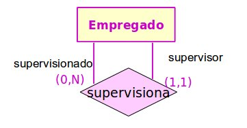
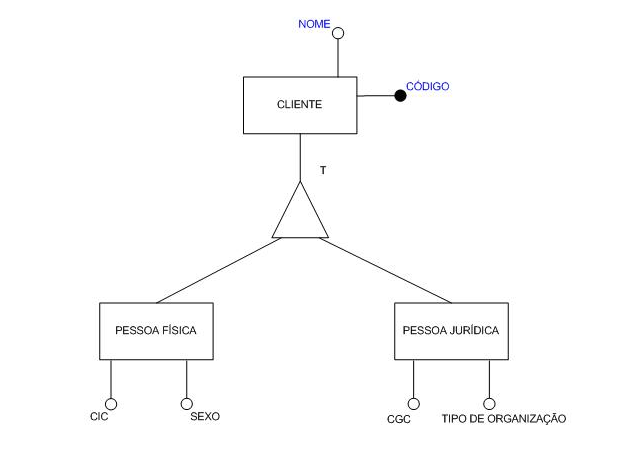
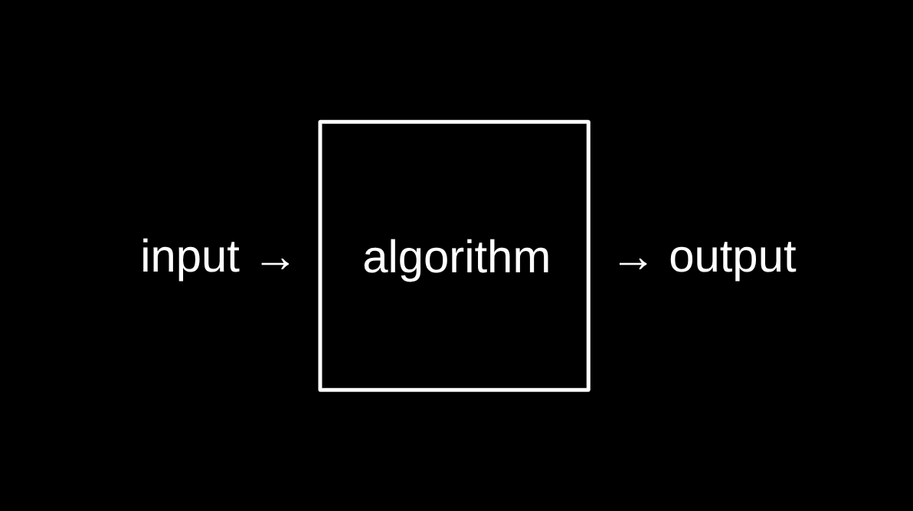

#### 1. Qual é a diferença fundamental entre `Dados`, `Informação` e `Conhecimento` no contexto de Sistemas de Informação?

- **Dados** são _fatos_ brutos, sem interpretação.
- **Informação** são dados interpretatos (_sentido, relevância e propósito_), utilizados como parte de um argumento.
- **Conhecimento (Ciência de dados)** coletânea de informações organizadas de forma lógica, possibilitando analisar o passado-presente para entender o futuro (novas tendências).

---

#### 2. Modelo ER: O que diferencia uma "Entidade Forte" de uma "Entidade Fraca" na modelagem conceitual?

- Entidades fortes tem sua **existência justificada** por conta própria, já as fracas depêndem de uma entidade forte para existir (ou seja, ela sozinha são se justifica; `EForte -> EFraca`).

---

#### 3. Mapeamento Relacional: Ao mapear os relacionamentos do modelo conceitual (MER) para o modelo lógico (tabelas), quais são as três técnicas principais e quando aplicá-las?

- A diferença básica entre o MER (conceitual) e o DER (lógico) é que a construção do primeiro é independente do paradigma da tecnologia (SGDB) escolhido. Portanto, ao fazer o DER adiciona-se detalhamento. Quanto as técnicas básicas para essa trasição temos:
  - Relacionamentos `N:N` (entidades associativas) tornam-se tabelas;
  - `1:N`: ao invés de criar uma tabela própria para o relacionamento, uma chave estrangeira é inclusa à entidade que tem maior cardinalidade. Aprofundando-se, essa dica nos ajuda a respeitar BCNF (_A -> B, A é a PK_) e, por concequência, a 3NF (sem transitivade).
  - `1:1`: Duas entidades podem ser fundidas em uma única tabela, o que evita redundância.

---

#### 4. Sendo um atributo multivalorado, quais são as duas soluções de mapeamento aceitáveis para o modelo relacional?

- Definir uma única coluna para o armazenamento daqueles dados (quantidade de atributos é pequena) ou criar uma nova tabela relacionada à entidade original por uma FK.

---

#### 5. O que compõe uma entidade associativa entre um FUNCIONÁRIO e um DEPENDENTE?

- Pela combinação do atributo chave da entidade forte com o atributo chave parcial da entidade fraca.

---

#### 6. Restrição de participação: ocorre quando uma entidade precisa, **obrigatoriamente**, estar associada a outra entidade por meio de um relacionamento (`cardinalidade_mínima == 1`). Como essa especificação é representada graficamente?

- Linhas duplas conectando a entidade ao relacionamento.

---

#### 7. Um cenário onde ocorrências de uma mesma entidade se associam entre si - por exemplo, SUPERVISOR e `FUNCIONÁRIO` (ambos pertêcem a mesma tabela):

- Relacionamento Recursivo, Unário ou Auto Relacionamento.
  

- Como represetar isso no modelo conceitual? Adicionar uma nova coluna de chave primária contendo o id do supervisor (técnica de 1:N).

---

#### 8. Qual a técnica de mapeamento recomendada para um relacionamento ternário na transição do modelo conceitual para o modelo lógico?

- Criar uma tabela exclusiva para o relacionamento.

```
TABELA: PROFESSOR           TABELA: TURMA              TABELA: DISCIPLINA
 +--------------+-------+    +----------+------+        +---------------+-------+
 | id_professor | nome  |    | id_turma | sala |        | id_disciplina | sigla |
 +--------------+-------+    +----------+------+        +---------------+-------+
 | 1            | Will  |    | T1       | 101  |        | D1            | BD    |
 +--------------+-------+    +----------+------+        +---------------+-------+

          ↘                      ↓                       ↙
                 (Chaves Estrangeiras migram para cá)

               TABELA PRÓPRIA (O Relacionamento): MINISTRA
               +--------------+----------+---------------+----------+
               | id_professor | id_turma | id_disciplina | semestre |
               +--------------+----------+---------------+----------+
               | 1            | T1       | D1            | 2026.1   |
               +--------------+----------+---------------+----------+
                 \____________________________________/      |
                   Chave Primária Composta (as 3 chaves)   Atributo do
                                                           Relacionamento
```

---

#### 9. Para definir a `cardinalidade máxima em um relacionamento ternário` (como a relação entre PROFESSOR, DISCIPLINA e TURMA), qual é a abordagem correta adotada durante a modelagem?

- Fixam-se duas entidades (ex: dado um professor e uma turma) para perguntar quantas ocorrências da terceira entidade (disciplinas) podem se associar a elas, tomando a decisão baseada na semântica do problema.

---

#### 10. A especialização/generalização (`herança entre entidades, como "Pessoa" gerando "Aluno" e "Professor"`) possui três técnicas principais de mapeamento para tabelas. Qual das alternativas abaixo NÃO é uma dessas três soluções ensinadas na aula?

- A) Criar uma tabela única para a entidade genérica e especializações (Tabelão que junta tudo e gera muitos NULLs).

```
TABELÃO: PESSOA
+----+-------+-----------+-----------------+-------------------+
| id | nome  | tipo      | matricula_aluno | salario_professor |
+----+-------+-----------+-----------------+-------------------+
| 1  | Ana   | ALUNO     | 2026001         | NULL              |
| 2  | Will  | PROFESSOR | NULL            | 10000.00          |
+----+-------+-----------+-----------------+-------------------+
```

- B) Criar tabelas tanto para a entidade genérica quanto para as entidades especializadas.

```
TABELA: PESSOA (Genérica)
 +-----------+-------+
 | id_pessoa | nome  |
 +-----------+-------+
 | 1         | Ana   |
 | 2         | Will  |
 +-----------+-------+

 TABELA: ALUNO                     TABELA: PROFESSOR
 +------------+-----------+        +------------+----------+
 | #id_pessoa | matricula |        | #id_pessoa | salario  |
 +------------+-----------+        +------------+----------+
 | 1          | 2026001   |        | 2          | 10000.00 |
 +------------+-----------+        +------------+----------+
 (O ID migra como Chave Estrangeira e também serve como Chave Primária aqui)

```

- C) Criar tabelas apenas para as entidades especializadas (ignorando a criação de uma tabela para a entidade genérica).

```
TABELA: ALUNO
 +----+-------+-----------+
 | id | nome  | matricula |
 +----+-------+-----------+
 | 1  | Ana   | 2026001   |
 +----+-------+-----------+

 TABELA: PROFESSOR
 +----+-------+----------+
 | id | nome  | salario  |
 +----+-------+----------+
 | 2  | Will  | 10000.00 |
 +----+-------+----------+
```

- **_ERRADA_**: D) Criar uma tabela própria apenas para o triângulo do relacionamento de herança, contendo apenas chaves estrangeiras.

**Representação de herança no MER**


---

#### 10. Verdadeiro ou falso:

1. Em um relacionamento binário com cardinalidade 1:N, a regra de mapeamento dita que a chave estrangeira deve ser colocada na tabela que representa o lado "1" do relacionamento.

- Falso: a chave estrangueira deve ser colocada na entidade/tabela de maior cadinalidade.

2. Entidades fracas não possuem sentido de existir de forma individual. Por isso, no mapeamento relacional, a tabela resultante de uma entidade fraca herda a chave primária da sua entidade forte associada.

- Falso: É um chave composta (FK da entidade forte + PK da entidade fraca), se fosse só herdada não poderia existir mais de uma dependência.

3. Em um relacionamento N:N, a técnica correta de mapeamento é criar uma "Tabela Própria", cuja chave primária será composta pela junção das chaves das tabelas envolvidas.

4. Atributos derivados no modelo ER (como a "idade" calculada pela data de nascimento) devem obrigatoriamente gerar uma nova tabela no modelo físico.

- Falso: a melhor prática é calcula-lá (idade) em tempo de consulta.

---

#### 11. Um Sistema de Informação Computadorizado possui quatro atividades básicas que envolvem a manipulação de dados para atingir seus objetivos. Quais são essas quatro atividades (ou etapas) fundamentais apresentadas em sala?

- Eu, pessoalmente, conheço três atividades básicas: entrada -> processamento -> saída. Algumas literatura definem uma quarta, o feedback que se refere a ajustes e mudanças na entrada ou processamento.



---

#### 12. Na modelagem de dados, existe uma diferença conceitual muito importante entre "Esquema" e "Instância" (ou estado). Como você definiria cada um desses dois conceitos?

- `Schema`: script base de criação de tabelas, definição de colunas e tipos de dados.
- `Intância`: linhas dessa tabela, ou seja, objetos físicos que fazem parte do mesmo escopo lógoco abstraído em um mesmo molde.

---

#### 13. Imagine o cenário clássico de uma universidade: A entidade ALUNO se relaciona com a entidade DISCIPLINA através do relacionamento MATRÍCULA (cardinalidade N:N). Se precisarmos registrar a "Nota" final do aluno naquela disciplina, onde esse atributo deve ser colocado no Diagrama ER e por quê?

- Sendo um relacionamento N:N, temos uma entidade associatíva que pode ser nomeada como: `DESEMPENHO`, responsável por armazenar informações como a nota e presença, além de conectar as outras três entidades com FK.

- Resumindo, esse atributo deve pretencer ao relacionamento ternário.

---

#### 14. No modelo ER, muitas vezes a cardinalidade é expressa usando parênteses, como por exemplo (0,N) ou (1,1). O que significa, na prática, uma restrição de participação com cardinalidade mínima 0 e o que significa uma com cardinalidade mínima 1?

- Quando temos uma restrição a carnidalidade mínima deve ser 1, pois a entidade deve obrigatóriamente estar associada a aquela relação. Agora, quanto temos um relacionamento opcional a carnidalidade mínima pode ser 0.

---

#### 15. Normalização — 1FN: O que significa dizer que um atributo deve ser "atômico"? Dê um exemplo de violação da 1ª Forma Normal e como corrigi-la.

- A primeira forma normal refere-se a correção de atributos multivalores, onde eles são reorganizados em uma tabela própria estando representados de maneira atômica.

- **Violação:**

```
TABELA: ALUNO
+----+-------+--------------------------------+
| id | nome  | telefones                      |
+----+-------+--------------------------------+
| 1  | Ana   | (88)99999-0001, (88)99999-0002 |
+----+-------+--------------------------------+
```

- **Correção:** criar uma tabela separada `TELEFONE(id_aluno FK, numero)`, ou uma linha por número.

---

#### 16. Normalização — 2FN: Quando dizemos que uma tabela viola a 2ª Forma Normal? Apresente um exemplo com chave primária composta.

- Uma violação da segunda forma nomal ocorre quanto tempos um PK Composta, e um atributo não chave tem contexto lógico (dependência) com apenas uma das chaves.

- **Violação:**

```
TABELA: MATRICULA
+-----------+---------------+-------------------+-----------+
| id_aluno  | id_disciplina | nome_disciplina   | nota      |
+-----------+---------------+-------------------+-----------+
| 1         | D1            | Banco de Dados    | 9.5       |
+-----------+---------------+-------------------+-----------+
```

- `nome_disciplina` depende apenas de `id_disciplina`, não da chave composta `(id_aluno, id_disciplina)`.

- **Correção:** mover `nome_disciplina` para a tabela `DISCIPLINA`.

---

#### 17. Normalização — 3FN: Explique o conceito de "dependência transitiva" e mostre como ela viola a 3FN.

- Temos uma dependência transitiva quando um atributo não-chave determina outro atributo não-chave.
- **Violação:**

```
TABELA: FUNCIONARIO
+-----+-------+---------+----------------+
| cpf | nome  | depto   | local_depto    |
+-----+-------+---------+----------------+
| 001 | João  | TI      | Bloco A        |
+-----+-------+---------+----------------+
```

- `cpf → depto → local_depto`: `local_depto` depende de `depto`, não de `cpf`.

- **Correção:** criar tabela `DEPARTAMENTO(id_depto, local_depto)` e referenciar por FK em `FUNCIONARIO`.

---

#### 18. Abstração: Qual a diferença entre "Classificação de Abstração", "Agregação de Abstração" e "Generalização"? Exemplifique cada uma no contexto de um banco de dados universitário.

- `Classificação de abstração`: refere-se ao processo de pegar objetos reais e classificar em abstrações já construídas.
- `Agregação de abstração`: objetos menores (peças) compõem um objeto geral.
- `Gerenalização e especialização`: refere-se a herança, uma classe abstrata que generaliza um conceito (Pessoa) e subclasses que adicionam novos atributos a entidade original.

---

#### 19. Modelo Físico: Qual é o papel do SGBD na execução do modelo físico? Cite dois SGBDs relacionais amplamente utilizados e uma característica de cada um.

- Ele é responsável por aplicar o script de criação e realizar as operações básicas necessárias para uma base de dados. Como exemplo de banco de dados relacionamais podemos sitar:
- Exemplos:
  - **PostgreSQL:** open source, altamente extensível, suporte robusto a tipos de dados avançados (JSON, arrays) e conformidade com padrões SQL.
  - **MySQL/MariaDB:** amplamente adotado em aplicações web, simples de configurar, com boa performance para leituras em larga escala.

---

#### 20. Restrições de Integridade: Explique a diferença entre `integridade de entidade` e `integridade referencial` no modelo relacional.

```
┌─────────────────────┬──────────────────────────┬──────────────────────────┐
│                     │  Integridade de Entidade │ Integridade Referencial  │
├─────────────────────┼──────────────────────────┼──────────────────────────┤
│ O que protege?      | Unicidade de cada tupla  │Consistência entre tabelas│
│ Atributo envolvido  │ Chave Primária (PK)      │ Chave Estrangeira (FK)   │
│ Regra principal     │ PK ≠ NULL                │ FK existe na tabela pai  │
│ Violação típica     │ Inserir PK nula ou dupla │ FK aponta p/ id inexist. │
│ Escopo              │ Dentro da própria tabela │ Entre duas tabelas       │
└─────────────────────┴──────────────────────────┴──────────────────────────┘

```

---

#### 21. Verdadeiro ou Falso — Normalização e Modelagem:

1. **Verdadeiro**: A BCNF (Boyce-Codd Normal Form) é mais restrita do que a 3FN. Por isso, toda relação em BCNF está necessariamente em 3FN.

2. **FALSO**: Um atributo derivado, como "idade" calculada a partir da data de nascimento, deve ser armazenado em uma coluna separada para garantir a consistência dos dados.

3. **Verdadeiro**: A 4FN resolve dependências multivaloradas. Uma tabela viola a 4FN quando contém dois ou mais atributos multivalorados independentes numa mesma relação.

4. **FALSO:** No modelo relacional, é possível ter uma relação sem nenhuma chave candidata (PK).

---

#### 22. Cenário prático — Modelagem de uma Biblioteca: Considerando uma biblioteca com LIVROS, AUTORES e EMPRÉSTIMOS feitos por USUÁRIOS, como você modelaria as entidades, cardinalidades e o relacionamento N:N entre LIVRO e AUTOR no modelo conceitual (MER)?

---
